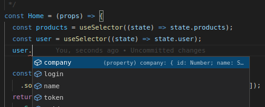

# Getting Started with Create React App

This project was bootstrapped with [Create React App](https://github.com/facebook/create-react-app).
## Available Scripts

In the project directory, you can run:

### `yarn start`

Runs the app in the development mode.\
Open [http://localhost:3000](http://localhost:3000) to view it in the browser.

The page will reload if you make edits.\
You will also see any lint errors in the console.

### `yarn test`

Launches the test runner in the interactive watch mode.\
See the section about [running tests](https://facebook.github.io/create-react-app/docs/running-tests) for more information.

### `yarn build`

Builds the app for production to the `build` folder.\
It correctly bundles React in production mode and optimizes the build for the best performance.

### Code Structure

```php
├── public
    ├── index.html
    └── manifest.json
├── src
    ├── assets
    ├── components
        ├── AwesomeComponent
            └── index.js
    ├── hooks
        ├── useSocket.js
        └── withAuth.js
    ├── pages
        ├── Home
            └── index.js
        ├── Menu
            └── index.js
        └── app.js
    ├── reducers
        ├── reducer.js
        └── store.js
    ├── services
        ├── api           // api http request
            └── index.js        
        ├── helpers       // class with functional helpers for strings, arrays, objects
        └── prototypes    // global extensions methods
            └── index.js
    ├── typings
        └── root.d.ts // dynamic req.params.id
    └── users.js
└── package.json
```
## why typings root


mainly, 
we need to rewrite types of some libs so that they work correctly...

### .d.ts declaration files will always help in vscode intellisense.




## consume Api services

all API's only return statuscode, reducer values ​​are updated by websocket
when the client sends a request, in the header it has a socket-id, the server will send 'dispatch' to that id, allowing real-time batch updates.

the bearer token in your header is also mandatory.

## web socket

whenever establishing a new connection, the token-id must be updated, and the authorization token sent back to the server.

the server will most of the time send a standard event called 'dispatch', which works directly inside the reducer

